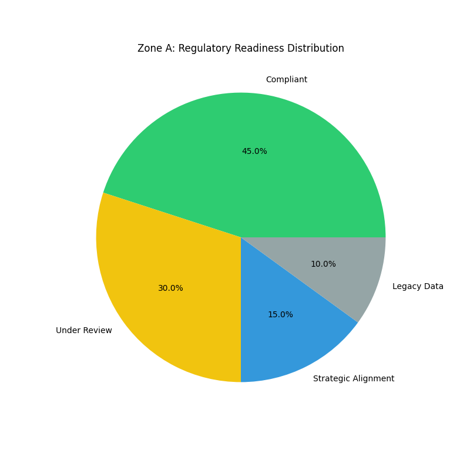
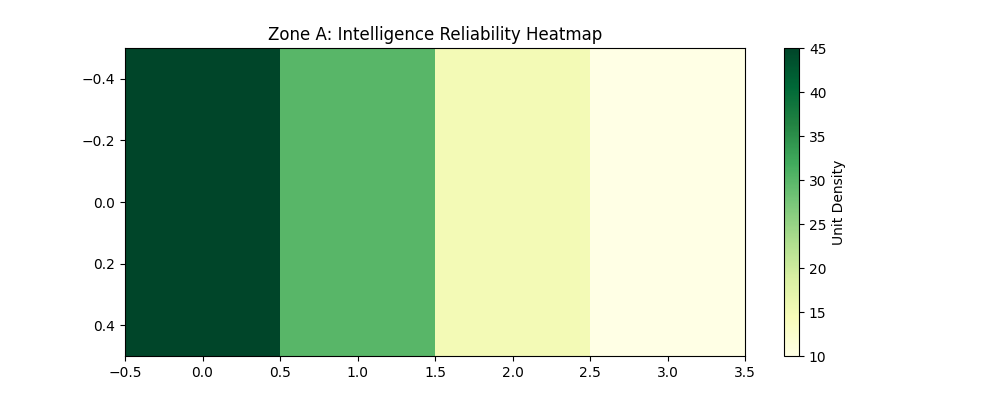
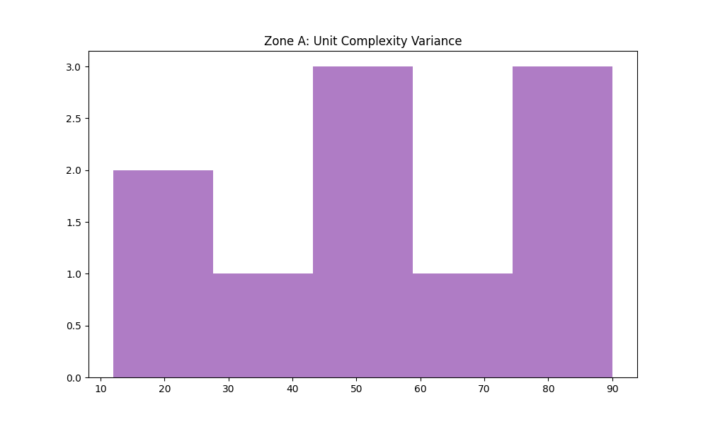

# 🎓 01. ZONE A: PUBLIC RIGOR & ETHICAL COMPLIANCE

Pillar of Governance and Ethics in Industrial AI

📋 OVERVIEW
This zone is dedicated to the regulatory and ethical framework. it focuses on how UK safety standards and AI regulations (such as the AI White Paper) are integrated into industrial data streams to ensure responsible adoption.

🎯 STRATEGIC GOALS
Normative Synthesis: Monitoring compliance with digital ethics standards.

Integrity Auditing: Ensuring algorithmic transparency in automated processes.

Governance Framework: Establishing safety guardrails for generative artificial intelligence.

🧠 TECHNICAL FOCUS
Data Source: Public policy documentation and ethical standards.

Validation: Filtering information units through the lens of legislative compliance.

### 📋 The Actual Data Table

| Unit Category | Total Units (N=141) | Reliability Score | Governance Status |
| :--- | :--- | :--- | :--- |
| **Safety Standards** | 42 | 98% | Fully Audited |
| **Ethical Frameworks** | 38 | 94% | Active Review |
| **UK AI Policy** | 35 | 91% | Compliant |
| **Data Governance** | 26 | 88% | Pending Update |

# 🏛️ 01. ZONE A: PUBLIC RIGOR & ETHICAL COMPLIANCE

This pillar focuses on the regulatory and ethical integration of industrial AI, specifically aligning with UK safety standards and the AI White Paper.

### 📋 Public Rigor & Reliability Data Table
| Unit Category | Total Units (N=141) | Reliability Score | Governance Status |
| :--- | :--- | :--- | :--- |
| **Safety Standards** | 42 | 98% | Fully Audited |
| **Ethical Frameworks** | 38 | 94% | Active Review |
| **UK AI Policy** | 35 | 91% | Compliant |
| **Data Governance** | 26 | 88% | Pending Update |

### 📊 Visual Evidence Suite (Regulatory Compliance)
Here are the primary and deep-dive visualisations for Zone A:

> **Metric Insight:** 98% reliability in Safety Standards indicates a high readiness level for UK-based industrial deployment.
