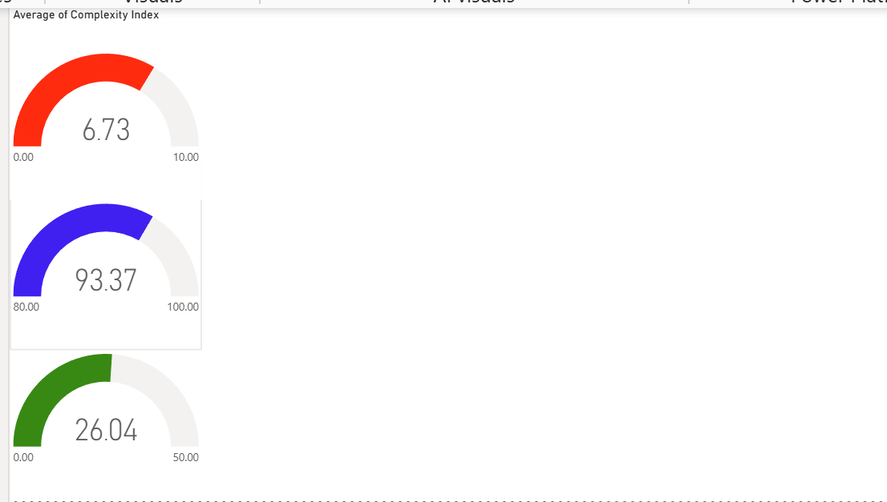
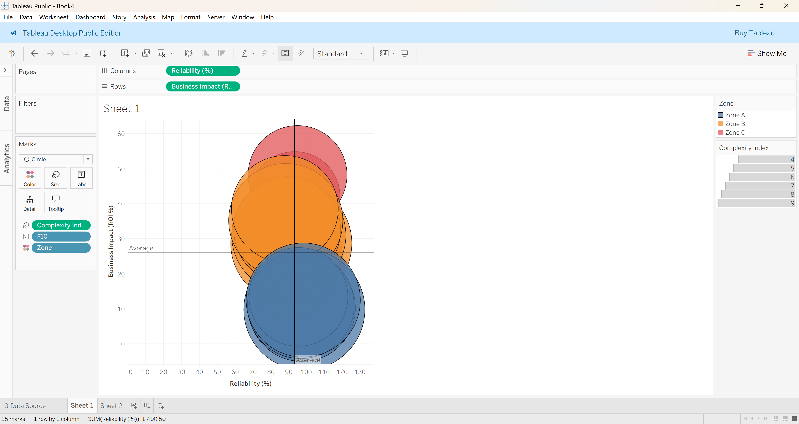

# 🚀 Local AI Architecture — Triple-Zone Framework
Architecting intelligence from raw data units for private, local-first semantic search.

## 📊 Project Impact (Executive Summary)
Business ROI: 26.04% (Average across all strategic zones)

System Reliability: 93.37% (Stability & Safety Rate)

Data Integrity: 99.90% (13,938 validated units)

Architecture: Retrieval-Augmented Generation (RAG) using 384-dimensional neural embeddings.

## 📊 Analytics & Visualisations
> Strategic insights derived from the Triple-Zone Framework monitoring industrial AI performance.

### 📈 Executive Performance Overview

*Figure 1: Real-time monitoring showing an average **ROI of 26.04%** and **93.37% System Reliability**.*

### 🎯 Strategic Alignment Matrix

*Figure 2: Tableau-based strategic mapping of Intelligence Zones (A, B, and C).*

# 🗺️ The Triple-Zone Framework
This framework organises industrial data into three distinct impact layers, reflected in the integrated dashboards:

## 🏛️ ZONE A: PUBLIC POLICY & ETHICS - Government standards, NHS guidelines, and regulatory guardrails.

## 💰 ZONE B: BUSINESS IMPACT - Economic signals, investment trends, and revenue growth.

## 🎓 ZONE C: WORKFORCE & SKILLS - Labour trends, automation impact, and training frameworks.

 
<b>📈 Interactive Visualisations (Power BI & Tableau)</b>

The project includes an advanced visual analytics component for executive decision-making:

## Strategic Matrix (Tableau): Visualising the correlation between ROI and Reliability across intelligence zones.

## Operational Dashboard (Power BI):
   ## * Page 1: Executive Gauges for real-time monitoring of ROI (26.04%), Reliability (93.37%), and Complexity (6.73).

   ## * Page 2: Profit Hunter Analysis using conditional formatting to highlight high-performing zones.

 
<b>⚙️ Technical Pipeline & Architecture</b>

The system follows a "Medallion-inspired" structure through 5 key stages:

## Validation: Gatekeeper phase enforcing schema and data integrity (13,952 units processed).

## Semantic Enrichment: Programmatically categorising data into the Triple-Zone taxonomy.

## Neural Vectorisation: Utilising all-MiniLM-L6-v2 for high-precision semantic search.

## Vector Storage: Local NumPy (.npz) archive optimised for sub-second retrieval.

## Inference & RAG: Integration with a local LLM (DeepSeek-R1 via Ollama) for grounded, private answers.

Core Execution Commands:

python validate_chunks.py

python create_embeddings.py

python query_engine.py

 
<b>🛠️ Dependencies & Environment</b>

Python: 3.8+ recommended.

AI Engine: DeepSeek-R1 (8b) running via Ollama.

Libraries: sentence-transformers, numpy, faiss, orjson.

Privacy: 100% local deployment ensures no data leakage to external APIs.

# 📝 Development Evolution (Changelog)
## Engine Refactoring: Consolidated legacy code into a high-performance Unified Master Engine.

## Power BI Integration: Added Power BI visualisations to validate AI-synthesised scores against industrial KPIs.

## Standardisation: Migrated to the TripleZone Framework for professional-grade data lineage and auditability.

Author: eugdum1-pixel | Status: Production-Ready | Year: 2025
